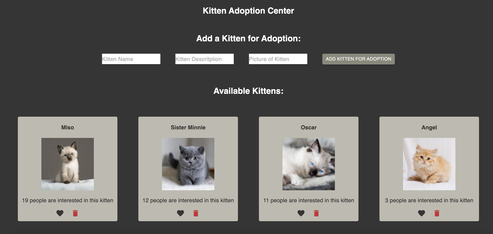

# React Photo Gallery:

## Description

_Duration: 19 hour Sprint_

This weekend, we were assignmed to make an interactive photogallery using React.js

## Screen Shots

### Built With
- [Node.js](https://nodejs.org/en/)
- React.js
- Express 
- Body-Parser
- 'PG'
- Postico

## Installation
1. Clone this repository for your own access.
2. Open up your editor of choice and run an `npm install`
3. Open two Terminal Tabs
4. Run `npm run server`  and `npm run client`in your terminal
5. Navigate to http://localhost:3000/

## Usage
This application is meant for the employees of a kitten adoption center
1. They are able to the name, description, and picture of a kitten that is available for adoption
2. See how many people are interested in adoption for each kitten (and even like a kitten themselves)
3. Delete a kitten from the page (maybe it's been adopted!)
4. Click on the kitten's photo see the description about the kitten (and click the description to see the photo again)

## License
[MIT](https://choosealicense.com/licenses/mit/)

## Acknowledgement
Thanks to [Prime Digital Academy](www.primeacademy.io) who equipped and helped me to make this application a reality.
